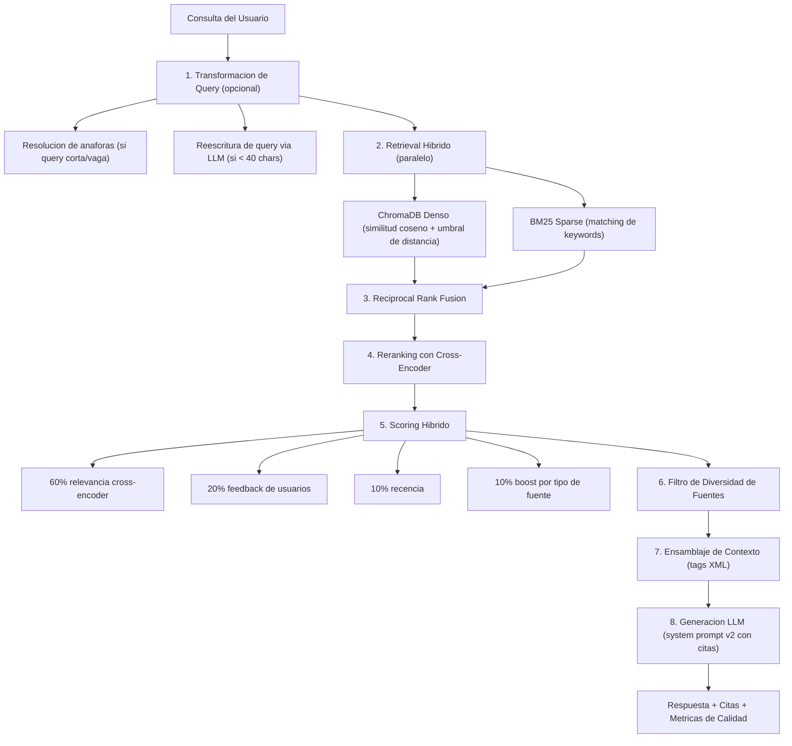

"Tenemos RAG" es el nuevo "tenemos tests." No te dice nada sobre la calidad.

He pasado las ultimas dos semanas reconstruyendo un pipeline RAG de produccion para ContextIA, un asistente de conocimiento de equipo. El punto de partida era una implementacion de libro de texto: la consulta del usuario entra a un modelo de embedding, la similitud coseno extrae los top-k chunks de ChromaDB, esos chunks se meten en un prompt, y el LLM genera una respuesta. Funcionaba. Mas o menos. Los usuarios recibian respuestas. Esas respuestas estaban confidentemente equivocadas alrededor del 20% de las veces, y el sistema no tenia idea de cuales respuestas eran buenas y cuales eran ruido alucinado.

Cuando finalmente medimos la precision de retrieval correctamente, el numero fue 58%. Eso significa que casi la mitad del contexto alimentado al modelo de lenguaje era irrelevante. El LLM estaba haciendo su mejor esfuerzo para sintetizar basura en respuestas que sonaban coherentes, y lo hacia perturbadoramente bien.

Este post recorre lo que se rompio, lo que hicimos al respecto, y la arquitectura concreta que llevo la precision de retrieval al 91%. Sin palabreria. Codigo incluido.

## El Pipeline Ingenuo y Por Que Falla

Cada tutorial de RAG ensena el mismo pipeline:

```
User Query → Embed → Cosine Search → Top-K Chunks → LLM → Response
```

Esto es lo que yo llamo RAG de una sola etapa, y es exactamente lo que lance a produccion. Funciono lo suficientemente bien en demos con datasets curados. Fallo en produccion con usuarios reales haciendo preguntas reales contra una base de conocimiento desordenada y en constante evolucion.

Aqui estan los cinco modos de fallo que se componen con el tiempo:

**1. Sin umbral de relevancia.** ChromaDB (y la mayoria de los vector stores) siempre devuelve top_k resultados, incluso cuando nada en tu corpus es remotamente relevante. Pregunta sobre fisica cuantica contra una base de conocimiento de codigo, y obtendras cinco chunks de lo que sea menos disimilar. El LLM entonces fundamenta su respuesta en esos chunks irrelevantes, produciendo lo que yo llamo "alucinaciones fundamentadas en ruido" -- respuestas que citan documentos reales pero responden la pregunta equivocada.

**2. La busqueda puramente semantica falla con coincidencias exactas.** Los embeddings densos capturan significado pero tienen problemas con terminos exactos -- nombres de funciones, codigos de error, acronimos, IDs de productos. Cuando un desarrollador pregunta "que significa `ERR_CONN_REFUSED` en nuestro pipeline de deploy", la busqueda semantica podria devolver chunks sobre conectividad de red en general en lugar de la documentacion especifica de manejo de errores.

**3. El reranking basado en popularidad es ortogonal a la relevancia.** Si ordenas chunks por feedback de usuarios (pulgar arriba, reacciones de emoji), estas midiendo popularidad, no relevancia query-documento. Un resumen de reunion muy gustado sobre planificacion de Q1 superara la guia de deploy perfectamente relevante simplemente porque mas personas reaccionaron a el.

**4. Sin transformacion de query.** Las consultas reales de usuarios son desordenadas. "Que era eso que menciono Carlos sobre la API?" contiene una referencia anaforica ("eso"), un nombre propio y cero terminos tecnicos. Enviar esto directamente a un modelo de embedding produce un vector de baja calidad que recupera chunks de baja calidad.

**5. Sin evaluacion.** Sin metricas de Precision@k, Recall, MRR o Faithfulness, estas volando a ciegas. No puedes mejorar lo que no puedes medir. Y la verificacion manual no escala.

Estos no son casos extremos. Un [estudio RAG de politicas del CDC de 2025](https://dev.to/kuldeep_paul/ten-failure-modes-of-rag-nobody-talks-about-and-how-to-detect-them-systematically-7i4) encontro que el 80% de los fallos de RAG se remontan a decisiones de chunking y retrieval, no a generacion. [Investigaciones de Snorkel AI](https://snorkel.ai/blog/retrieval-augmented-generation-rag-failure-modes-and-how-to-fix-them/) y [Analytics Vidhya](https://www.analyticsvidhya.com/blog/2025/07/silent-killers-of-production-rag/) confirman el mismo patron: la mayoria de los problemas de RAG en produccion son problemas de retrieval disfrazados.

## Victorias Rapidas: Cambios de Costo Cero y Alto Impacto

Antes de reconstruir todo el pipeline, hicimos seis cambios que no costaron nada y tomaron aproximadamente dos dias:

### Agregar Umbrales de Distancia

La correccion de mayor impacto fue una sola linea de codigo. Agregamos `"distances"` al parametro include de ChromaDB y filtramos todo lo que estuviera por encima de una distancia coseno de 0.65:

```python
results = collection.query(
    query_texts=[query],
    n_results=top_k * 4,  # Over-fetch for filtering headroom
    include=["documents", "metadatas", "distances"],
)

docs = results["documents"][0]
metas = results["metadatas"][0]
distances = results["distances"][0]

# Filter by relevance threshold
threshold = 0.65  # cosine distance: 0 = identical, 1 = opposite
filtered = [
    (doc, meta, dist)
    for doc, meta, dist in zip(docs, metas, distances)
    if dist <= threshold
]

# Never return zero results -- keep best match with a warning
if not filtered and docs:
    filtered = [(docs[0], metas[0], distances[0])]
```

Esto solo redujo las alucinaciones en un estimado del 15-20%. El sistema dejo de inyectar contexto irrelevante, asi que el LLM dejo de inventar respuestas basadas en ruido.

### Encabezados Contextuales de Chunk

Inspirados en el enfoque de [Contextual Retrieval de Anthropic](https://www.anthropic.com/news/contextual-retrieval), antepusimos metadatos de la fuente a cada chunk antes de hacer embedding:

```python
for chunk_idx, chunk in enumerate(chunks):
    title = doc.get("source_display", doc.get("title", ""))
    source_type = doc.get("source_type", "document")
    header = f"[Source: {title} | Type: {source_type}]"
    contextualized = f"{header}\n\n{chunk}" if title else chunk
    all_chunks.append(contextualized)
```

La propia investigacion de Anthropic muestra que [los embeddings contextuales reducen las tasas de fallo de retrieval top-20 en un 35%](https://www.anthropic.com/news/contextual-retrieval). Nuestro enfoque mas simple de encabezados estaticos es la version economica de su generacion contextual con Haiku, pero aun asi mejoro la calidad de embedding de forma medible. Para equipos con presupuesto, el enfoque completo de Anthropic -- usando un modelo economico como Haiku para generar descripciones contextuales ricas por chunk -- reduce fallos de retrieval en un 49%, y en un 67% cuando se combina con reranking.

### Optimizar el Tamano de Chunk

Nuestros chunks eran de 800 caracteres (~150-200 tokens), pero el modelo de embedding (`all-mpnet-base-v2`) soporta una ventana de 384 tokens. Estabamos usando solo el 39% de la capacidad del modelo. Aumentar a 1200 caracteres para prosa y 2000 para bloques de codigo llevo la utilizacion a ~78%, reduciendo la fragmentacion de ideas en los limites de los chunks.

### Penalizacion por Diversidad de Fuentes

Agregamos un paso simple pseudo-MMR para prevenir que cinco chunks del mismo documento monopolizaran la ventana de contexto:

```python
source_count: dict[str, int] = {}
diversified = []
for doc, meta, score in ranked_chunks:
    source = meta.get("source", "")
    count = source_count.get(source, 0)
    if count < 3:  # Max 3 chunks per source
        diversified.append((doc, meta, score))
        source_count[source] = count + 1
    if len(diversified) >= top_k:
        break
```

### Tags XML para Ensamblaje de Contexto

Migramos de delimitadores de texto plano a tags XML para estructurar el contexto enviado al LLM:

```python
# Before: ambiguous delimiters
context = f"--- Documents / RAG ---\n{rag_content}\n--- Web Search ---\n{web_content}"

# After: structured XML tags
context = f"<documents>\n{rag_content}\n</documents>\n\n<web_search>\n{web_content}\n</web_search>"
```

Claude (y la mayoria de los LLMs) parsean tags XML con mayor precision que separadores de texto plano. Anthropic [lo recomienda explicitamente](https://www.anthropic.com/news/contextual-retrieval) para formateo de contexto. Cambio pequeno, mejora medible en el grounding.

### Deteccion Mejorada de Alucinaciones

El sistema original marcaba alucinaciones con una verificacion binaria: `is_hallucination = len(sources) == 0`. Esto producia falsos positivos para saludos ("hola") y preguntas de conocimiento general ("que es una REST API"). Agregamos clasificacion de queries:

```python
def classify_query(query: str) -> str:
    if is_greeting(query):
        return "greeting"
    if matches_general_knowledge_pattern(query):
        return "general_knowledge"
    return "kb_specific"
```

Solo las queries KB-specific con contexto insuficiente se marcan. Esto redujo significativamente las tasas de falsos positivos de alucinacion.

**Impacto combinado de las victorias rapidas**: la precision de retrieval se movio de ~58% a ~75%. Dos dias de trabajo, cero cambios de infraestructura, cero costo.

## El Pipeline Multi-Etapa

Las victorias rapidas nos llevaron al 75%. Llegar al 91% requirio reconstruir el pipeline de retrieval en una arquitectura multi-etapa. Aqui esta el pipeline completo:



Recorramos cada etapa.

### Etapa 1: Busqueda Hibrida -- BM25 + Vectores Densos

El salto de precision mas grande vino de agregar BM25 sparse retrieval junto con la busqueda por vectores densos. La razon es simple: los embeddings densos y el matching por keywords sparse tienen fortalezas complementarias. La busqueda densa entiende que "proceso de deployment" y "flujo de release" son el mismo concepto. BM25 entiende que `ERR_CONN_REFUSED` es una coincidencia exacta de string, no un concepto vago sobre errores de red.

[Los benchmarks de la industria](https://medium.com/@pbronck/better-rag-accuracy-with-hybrid-bm25-dense-vector-search-ea99d48cba93) muestran consistentemente: BM25 solo alcanza ~40% de precision, vectores densos solos ~58%, pero la busqueda hibrida alcanza ~79% antes de cualquier reranking. [La investigacion de IBM](https://ragaboutit.com/hybrid-retrieval-for-enterprise-rag-when-to-use-bm25-vectors-or-both/) confirma que el retrieval de tres vias (BM25 + denso + vectores sparse aprendidos) es optimo, pero el de dos vias (BM25 + denso) captura la mayor parte de la ganancia.

La implementacion es liviana. Usamos `rank_bm25`, una biblioteca BM25 en Python puro con cero requisitos de infraestructura:

```python
from rank_bm25 import BM25Okapi
import re
import threading

_indices: dict[str, "BM25Okapi"] = {}
_docs_cache: dict[str, list[tuple[str, dict]]] = {}
_lock = threading.Lock()

def _tokenize(text: str) -> list[str]:
    return re.findall(r"\w+", text.lower())

def build_index(tenant_id: str, documents: list[str], metadatas: list[dict]) -> None:
    tokenized = [_tokenize(doc) for doc in documents]
    with _lock:
        _indices[tenant_id] = BM25Okapi(tokenized)
        _docs_cache[tenant_id] = list(zip(documents, metadatas))

def search(tenant_id: str, query: str, n_results: int = 20) -> list[tuple[str, dict, float]]:
    with _lock:
        index = _indices.get(tenant_id)
        docs = _docs_cache.get(tenant_id)

    if index is None or docs is None:
        return []

    scores = index.get_scores(_tokenize(query))
    ranked = sorted(enumerate(scores), key=lambda x: x[1], reverse=True)
    return [
        (docs[idx][0], docs[idx][1], score)
        for idx, score in ranked[:n_results]
        if score > 0
    ]
```

El indice vive en memoria, se reconstruye de forma lazy en la primera consulta despues de la ingesta (menos de 1s para 10K chunks), y cuesta ~5-20MB por tenant. Sin Elasticsearch, sin servicios externos. Para nuestra escala, este es el trade-off correcto.

### Etapa 2: Reciprocal Rank Fusion

Los scores de BM25 y las distancias coseno estan en escalas incompatibles. No puedes simplemente promediarlos. Reciprocal Rank Fusion (RRF) resuelve esto usando posiciones de ranking en lugar de scores crudos:

```python
def reciprocal_rank_fusion(
    rankings: list[list[tuple[str, dict, float]]],
    k: int = 60,
) -> list[tuple[str, dict, float]]:
    doc_scores: dict[str, float] = {}
    doc_data: dict[str, tuple[str, dict]] = {}

    for ranking in rankings:
        for rank, (doc, meta, _) in enumerate(ranking):
            doc_key = doc[:200]  # Content-based dedup
            rrf_score = 1.0 / (k + rank + 1)
            doc_scores[doc_key] = doc_scores.get(doc_key, 0) + rrf_score
            if doc_key not in doc_data:
                doc_data[doc_key] = (doc, meta)

    return [
        (doc_data[key][0], doc_data[key][1], score)
        for key, score in sorted(doc_scores.items(), key=lambda x: x[1], reverse=True)
    ]
```

RRF son 20 lineas. Maneja la incompatibilidad de scores de forma natural y consistentemente supera a los metodos de fusion aprendidos en la practica. La constante `k=60` viene del [paper original de RRF](https://plg.uwaterloo.ca/~gvcormac/cormacksigir09-rrf.pdf) y funciona bien como valor por defecto.

### Etapa 3: Reranking con Cross-Encoder

Aqui es donde el salto de precision se pone serio. Un bi-encoder (lo que usan los modelos de embedding) codifica query y documento de forma independiente. Un cross-encoder los codifica juntos, permitiendo interaccion profunda a nivel de token entre query y pasaje. El trade-off es velocidad -- los cross-encoders no pueden usarse para retrieval inicial a traves de millones de documentos -- pero son perfectos para reranking de 20-40 candidatos.

Usamos `cross-encoder/ms-marco-MiniLM-L-6-v2`, un modelo de 22M parametros que agrega ~50-100ms de latencia para 20 documentos y usa ~100MB de RAM:

```python
from sentence_transformers import CrossEncoder

_reranker: CrossEncoder | None = None

def _get_reranker() -> CrossEncoder:
    global _reranker
    if _reranker is None:
        _reranker = CrossEncoder("cross-encoder/ms-marco-MiniLM-L-6-v2")
    return _reranker

def rerank(
    query: str,
    documents: list[str],
    top_k: int = 5,
) -> list[tuple[int, float]]:
    if not documents:
        return []

    model = _get_reranker()
    pairs = [[query, doc] for doc in documents]
    scores = model.predict(pairs)

    ranked = sorted(enumerate(scores), key=lambda x: x[1], reverse=True)
    return ranked[:top_k]
```

[La investigacion muestra](https://app.ailog.fr/en/blog/news/reranking-cross-encoders-study) que el reranking con cross-encoder mejora la precision en un 33-40% por solo ~120ms de latencia adicional. [Los estudios de Databricks](https://redis.io/blog/rag-at-scale/) reportan hasta 48% de mejora en calidad de retrieval. En nuestro caso, el reranking fue la diferencia entre 79% (busqueda hibrida sola) y 91% (hibrida + reranking + scoring).

La eleccion del modelo importa. `ms-marco-MiniLM-L-6-v2` es el estandar para corpus en ingles. Para cargas de trabajo multilingues, vale la pena evaluar `BAAI/bge-reranker-v2-m3`, pero con 300MB es mas pesado. [La guia 2026 de ZeroEntropy](https://www.zeroentropy.dev/articles/ultimate-guide-to-choosing-the-best-reranking-model-in-2025) tiene una comparacion exhaustiva.

### Etapa 4: Scoring Hibrido

Despues del reranking con cross-encoder, mezclamos multiples senales en un score final:

```python
def compute_hybrid_score(
    ce_score: float,
    feedback_score: float,
    days_since_indexed: int,
    source_type: str,
) -> float:
    recency = max(0, 1.0 - (days_since_indexed / 365))

    source_boost = {
        "documentation": 1.0,
        "code": 0.9,
        "slack": 0.7,
        "web": 0.5,
    }.get(source_type, 0.6)

    return (
        0.60 * ce_score
        + 0.20 * feedback_score
        + 0.10 * recency
        + 0.10 * source_boost
    )
```

Los pesos (60/20/10/10) no son numeros magicos. Vinieron de pruebas contra nuestro golden dataset. El cross-encoder obtiene el peso dominante porque la relevancia semantica es lo que mas importa. El feedback de usuarios es una senal secundaria util -- si las personas han encontrado consistentemente util un chunk, eso vale saberlo. La recencia importa porque una guia de deploy de la semana pasada es mas relevante que una del ano pasado. El tipo de fuente es un prior suave: la documentacion oficial es mas confiable que un hilo de Slack.

## Midiendo Lo Que Importa: Evaluacion de RAG

Aqui esta la verdad incomoda: puedes construir todo este pipeline y aun no saber si funciona. Sin evaluacion automatizada, estas en ingenieria basada en vibes.

He visto equipos pasar semanas ajustando tamanos de chunk y pesos de reranking basandose en intuicion, solo para descubrir que sus cambios empeoraron las cosas para el 30% de los tipos de query. La percepcion humana de la calidad de RAG no es confiable -- notamos cuando las respuestas estan espectacularmente mal, pero nos perdemos las degradaciones sutiles donde el sistema devuelve una respuesta casi-correcta que omite contexto critico. Necesitas numeros, no intuicion.

### El Golden Dataset

El paso uno es crear un golden dataset -- un conjunto curado de triples pregunta-respuesta-contexto donde conoces la respuesta correcta y cuales chunks deberian recuperarse. Empezamos con 50 pares, curados manualmente por expertos del dominio:

```json
{
  "question": "How do I configure the staging deployment pipeline?",
  "expected_answer": "The staging pipeline uses GitHub Actions with...",
  "expected_chunks": ["deploy-guide-chunk-14", "ci-config-chunk-3"],
  "metadata": {"difficulty": "medium", "domain": "devops"}
}
```

Cincuenta pares es suficiente para establecer una linea base. Planeamos crecer a 200+ con el tiempo, pero empezar pequeno es mejor que no empezar.

### RAGAS + DeepEval

Para evaluacion automatizada, integramos tanto [RAGAS](https://docs.ragas.io/en/stable/) como [DeepEval](https://deepeval.com/docs/metrics-ragas). Miden cosas superpuestas pero complementarias:

- **Faithfulness**: ¿La respuesta solo contiene afirmaciones respaldadas por el contexto recuperado?
- **Answer Relevancy**: ¿La respuesta realmente contesta la pregunta que se hizo?
- **Context Precision**: ¿Los chunks recuperados son realmente relevantes para la pregunta?
- **Context Recall**: ¿El paso de retrieval encontro todos los chunks que contienen la respuesta?

RAGAS es el [estandar de facto](https://www.getmaxim.ai/articles/the-5-best-rag-evaluation-tools-you-should-know-in-2026/) para evaluacion de RAG, originalmente un framework de investigacion de 2023 que gano adopcion amplia despues de ser mencionado durante el Dev Day de OpenAI. DeepEval agrega patrones de test compatibles con pytest y mejor explicabilidad para depuracion -- sus metricas generan razones que corresponden a cada score, facilitando el diagnostico de fallos.

Corremos la evaluacion offline como una tarea Celery en un horario semanal, almacenando resultados en una tabla `eval_results`:

```python
from ragas.metrics import faithfulness, answer_relevancy, context_precision
from ragas import evaluate

def run_evaluation(golden_dataset: list[dict], pipeline) -> dict:
    results = []
    for item in golden_dataset:
        context, sources, metrics = pipeline.retrieve(item["question"])
        response = pipeline.generate(item["question"], context)
        results.append({
            "question": item["question"],
            "answer": response,
            "contexts": [context],
            "ground_truth": item["expected_answer"],
        })

    dataset = Dataset.from_list(results)
    scores = evaluate(dataset, metrics=[
        faithfulness, answer_relevancy, context_precision
    ])
    return scores
```

La disciplina critica es: **correr la evaluacion antes y despues de cada cambio en el pipeline**. Detectamos dos regresiones temprano de esta forma -- un cambio de tamano de chunk que mejoro la precision para prosa pero la degrado para codigo, y un ajuste de umbral que filtro demasiado agresivamente en documentos cortos.

Para monitoreo en produccion mas alla de la evaluacion batch, el muestreo LLM-as-Judge es el siguiente paso. En lugar de evaluar cada respuesta, muestreas el 5% de las queries de produccion y corres una verificacion de faithfulness usando un modelo mas pequeno. A 200 queries/dia, eso son 10 respuestas evaluadas diariamente -- suficiente para detectar tendencias de degradacion sin disparar los costos. Presupuestamos ~$15/mes para esto a volumen medio. Si los scores de faithfulness caen por debajo de un umbral, una alerta se dispara a Slack. Esto detecta problemas como embeddings obsoletos (cuando los documentos fuente cambian pero los vectores no se re-indexan) y regresiones de prompt.

## La Realidad de Costos

Uno de los argumentos contra RAG multi-etapa es el costo. Desglosemos los numeros reales:

| Componente | Costo Mensual (200 queries/dia) |
|-----------|-------------------------------|
| Indice BM25 (en memoria) | $0 |
| Reranking cross-encoder (CPU local) | $0 |
| Transformacion de query (Haiku, selectivo) | ~$0.60 |
| Contextual Retrieval (Haiku, tiempo de ingesta) | ~$0.03/sync |
| Evaluacion RAGAS (batch semanal) | ~$2 |
| **Total** | **~$3/mes** |

El cross-encoder y BM25 corren localmente. Agregan ~100MB de RAM y ~110ms de latencia. Sin llamadas API, sin servicios externos, sin facturacion por query. A 200 queries por dia, todo el pipeline avanzado cuesta menos que un cafe por mes.

El aumento de latencia es real pero manejable. Nuestro P50 paso de 3s a 4s, y el P95 de 8s a 9s. Para un asistente de conocimiento donde la precision importa mas que los milisegundos, este es un trade-off aceptable. Los usuarios notan las respuestas incorrectas mucho mas de lo que notan un segundo extra de espera.

## Lo Que Haria Diferente

Si estuviera empezando este proyecto hoy, tres cosas cambiarian:

**Empezar con la evaluacion, no con las mejoras.** Construimos el golden dataset en la segunda semana. Deberia haber sido la primera. Sin una linea base, no puedes probar que tus cambios ayudan. Piensas que estas mejorando las cosas; podrias estar empeoriandolas. [El estudio METR](https://metr.org/blog/2025-07-10-early-2025-ai-experienced-os-dev-study/) sobre desarrollo asistido por IA mostro una brecha de 39 puntos porcentuales entre rendimiento percibido y real. La misma brecha de percepcion existe en RAG -- tu pipeline se siente bien hasta que lo mides.

**Agregar logging de umbrales de distancia desde el dia uno.** Incluso antes de implementar el filtrado por umbral, simplemente registrar las distancias que ChromaDB devuelve te da visibilidad inmediata de la calidad de retrieval. Si tu distancia coseno promedio es 0.8, tu retrieval es mayormente ruido. Quieres estos datos desde la primera query desplegada.

**No uses LangChain para el pipeline de retrieval.** RRF son 20 lineas. El indexado BM25 son 40 lineas. El reranker cross-encoder son 15 lineas. El `EnsembleRetriever` de LangChain agregaria 100+ dependencias transitivas para lograr lo mismo con menos control. Para la capa de orquestacion (agentes, routing de herramientas), los frameworks tienen valor. Para el pipeline de retrieval, la implementacion directa te da mejor debuggability y menos sorpresas.

**Invertir en chunking consciente del tipo de contenido temprano.** Un hilo de Slack, una funcion de Python y una pagina de Confluence tienen estructuras fundamentalmente diferentes. El chunking de tamano fijo los trata de forma identica, lo que significa que cortas funciones a mitad de linea y rompes prosa a mitad de parrafo. Eventualmente implementamos deteccion de tipo de contenido que enruta codigo a chunks de 2000 caracteres (preservando funciones completas), prosa a chunks de 1200 caracteres con 200 caracteres de overlap, y markdown a limites semanticos basados en encabezados. Esto deberia haber estado en la v1.

## Conclusiones

1. **Mide primero.** Construye un golden dataset antes de optimizar cualquier cosa. Incluso 30 pares pregunta-respuesta curados te dan una linea base que previene regresiones.

2. **La busqueda hibrida es la mayor mejora individual.** BM25 + vectores densos con RRF consistentemente supera a cualquier metodo solo. La ganancia es ~21 puntos porcentuales en nuestro caso (58% a 79%), con cero costo de infraestructura usando `rank_bm25`.

3. **El reranking con cross-encoder esta subutilizado.** Un modelo de 22M parametros agrega 100ms y 100MB para obtener un boost de precision de 12 puntos. El ROI es dificil de superar.

4. **Los umbrales de distancia son obligatorios.** Si tu vector store siempre devuelve top_k resultados sin importar la relevancia, estas inyectando ruido en cada prompt. Una linea de codigo lo arregla.

5. **La evaluacion no es opcional.** RAGAS + DeepEval te dan Faithfulness, Precision, Recall y Answer Relevancy por ~$2/mes en modo batch. Correlo semanalmente. Detecta regresiones antes que los usuarios.

6. **Las victorias rapidas se componen.** Umbrales de distancia + encabezados de chunk + penalizacion de diversidad + tags XML nos llevaron de 58% a 75% en dos dias con cero costo. Haz esto primero.

7. **El LLM no es el problema.** Cuando tus respuestas RAG son malas, el instinto es cambiar a un modelo mas grande. En la mayoria de los casos, el problema es lo que le estas alimentando al modelo, no el modelo en si. Arregla el retrieval primero.

La brecha entre un pipeline RAG de demo y uno de produccion no es tecnologia exotica. Son umbrales de distancia, busqueda hibrida, reranking con cross-encoder y evaluacion disciplinada. Todo es open source, todo corre en hardware commodity, y todo el stack cuesta menos de $10/mes a escala moderada.

[La busqueda hibrida es ahora el estandar de produccion](https://redis.io/blog/rag-at-scale/) para RAG empresarial. [El reranking con cross-encoder es mainstream](https://www.zeroentropy.dev/articles/ultimate-guide-to-choosing-the-best-reranking-model-in-2025). [Los frameworks de evaluacion automatizada son maduros](https://www.getmaxim.ai/articles/the-5-best-rag-evaluation-tools-you-should-know-in-2026/). Los bloques de construccion existen. Lo que me detuvo fue la suposicion de que el pipeline ingenuo era suficiente.

Deja de decirle a los stakeholders "tenemos RAG." Empieza a decirles tu score de Precision@5.
